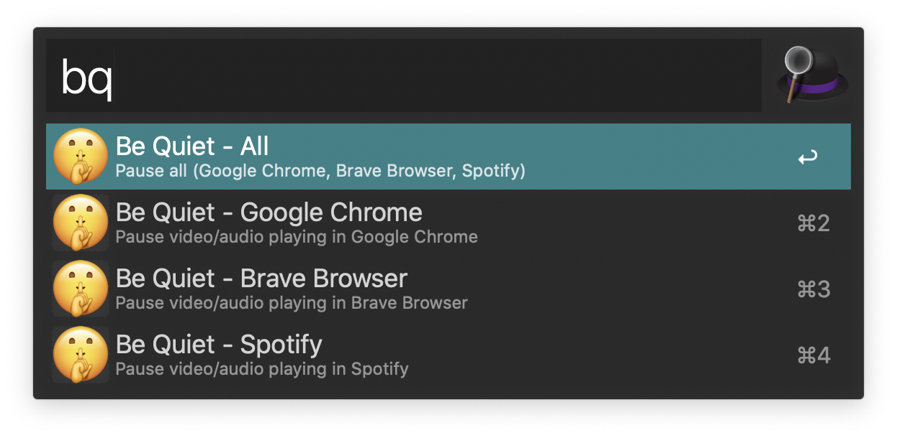

  <h1>Alfred Be Quiet 🤫</h1>

  <strong>Workflow to automatically pause audio/video playing</strong>

## Why?

If you have troubles finding a tab with audio playing, run this workflow and it will automatically pause the audio/video playing.

## Installation

1. Download the Alfred Workflow ([Be-Quiet.alfredworkflow](https://github.com/epilande/alfred-be-quiet/releases/latest/download/Be-Quiet.alfredworkflow)).
1. Double-click to import into Alfred (requires Powerpack).
1. For Chrome/Brave enable JavaScript from Apple Events: View -> Developer -> Allow JavaScript from Apple Events.

## Usage

- `bq {app}` - activate alfred workflow, select app to pause audio/video.

## More workflows

- 🔍 [alfred-browser-tabs](https://github.com/epilande/alfred-browser-tabs) - Search browser tabs from Chrome, Brave, & Safari.
- 🔐 [alfred-wifi-password](https://github.com/epilande/alfred-wifi-password) - Get Wi-Fi password from Keychain.
- 🗝 [alfred-password-generator](https://github.com/epilande/alfred-password-generator) - Workflow to generate passwords.
- 🎨 [alfred-prettier-clipboard](https://github.com/epilande/alfred-prettier-clipboard) - Format code in your clipboard with Prettier.

## License

[MIT License](https://oss.ninja/mit/epilande/)
